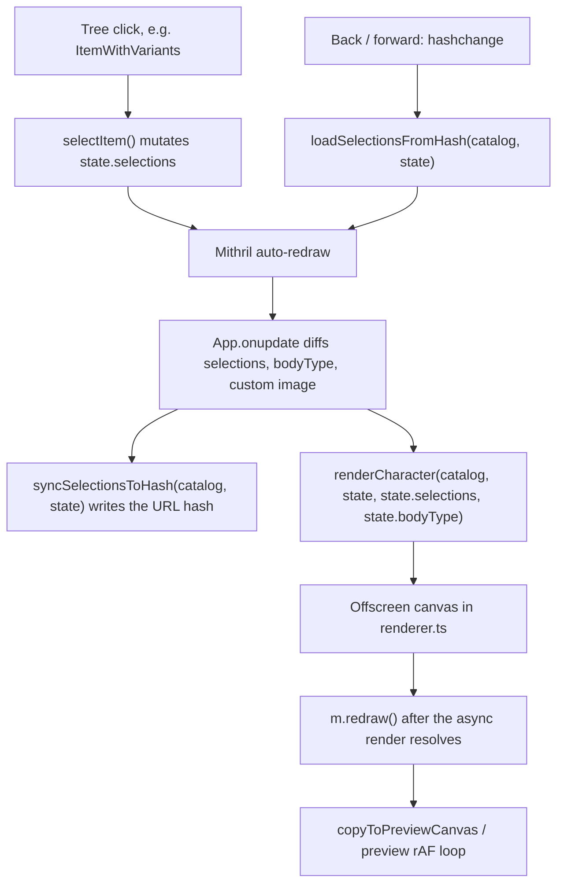

# Architecture

How the running app is wired, for orientation before changing it. Setup and
commands are in [CONTRIBUTING.md](CONTRIBUTING.md); the invariants you must not
break are in [AGENTS.md](AGENTS.md).

A Vite + [Mithril](https://mithril.js.org/) single-page app. Sprite art and
JSON definitions in the repo are compiled into generated metadata modules at
build time; the browser reads those through a catalog, composites the selected
layers onto an offscreen canvas, and packages that canvas into a ZIP.

## Generated metadata and the `dist/` alias

`sheet_definitions/` and `palette_definitions/` are the source of truth. The
Vite plugin in
[`vite/vite-plugin-item-metadata.ts`](vite/vite-plugin-item-metadata.ts) runs
`generateSources` and writes five ES modules to `dist/`. See
[File Generation](CONTRIBUTING.md#file-generation) for what each one contains.

**Source code never imports a `dist/` path.** It imports
`../<name>-metadata.js`, and `itemMetadataResolveAliases()` in
[`vite/wiring.ts`](vite/wiring.ts) installs a `resolve.alias` regex that
rewrites any specifier ending in a metadata basename to the `dist/` copy:

```typescript
// sources/install-item-metadata.ts — resolves to dist/index-metadata.js
import("../index-metadata.js");
```

This catches everyone once. The file is not next to the importer, and it does
not exist at all until `npm run dev` or `npm run build` has run. A resolve
failure here means `dist/` was never built, not that the import is wrong.

## Bootstrap

[`sources/main.ts`](sources/main.ts) is the composition root. As the entry
module runs, before any DOM exists:

1. `createCatalog()` produces `applicationCatalog`
   ([`sources/state/catalog.ts`](sources/state/catalog.ts)), and `createState()`
   produces `applicationState` ([`sources/state/state.ts`](sources/state/state.ts)).
2. `configureStateCatalog(applicationCatalog)` points the state layer at it, so
   `sources/state/` does not need the catalog instance threaded in. Tests may
   override effects with `setStateDeps` / `resetStateDeps`.
3. `DEBUG = getDebugParam()`, then `window.profiler = new PerformanceProfiler(...)`.
4. `void loadAllMetadata(applicationCatalog)` starts the metadata fetch without
   blocking, so download and parse overlap HTML parsing.

[`sources/install-item-metadata.ts`](sources/install-item-metadata.ts) does a
parallel `import()` of all five chunks and calls the matching
`catalog.registerFrom*Module` as each one lands, so readiness is **staged**
rather than all-or-nothing. Each registration triggers a coalesced redraw.

On `DOMContentLoaded`, three separate Mithril roots mount against the same
catalog and state instances:

| Element in `index.html` | Component |
| --- | --- |
| `#mithril-filters` | [`App`](sources/components/App.ts) |
| `#mithril-preview` | [`AnimationPreview`](sources/components/preview/AnimationPreview.ts) |
| `#mithril-spritesheet-preview` | [`FullSpritesheetPreview`](sources/components/preview/FullSpritesheetPreview.ts) |

Mounting happens immediately; hash hydration waits. The async block after mount
awaits `onIndexReady` and `onLiteReady`, then calls `initCanvas()`,
`initHashChangeListener()`, and `initState()`. Layers arrive later, and
`renderCharacter` awaits `onLayersReady` itself rather than holding up the UI.

Bootstrap also installs a few **sanctioned globals** for tooling, not for app
code to read: `window.profiler`, `window.canvasRenderer`,
`__LPC_waitCatalogAllReady`, and `__LPC_arePaletteModalMetadataChunksReady`.

## Selection flow

Nothing calls the renderer directly from an event handler. Selections mutate
plain state, Mithril redraws, and `App.onupdate` notices the change:



`App.onupdate` compares `JSON.stringify(state.selections)`, `state.bodyType`,
`state.customUploadedImage`, and `state.customImageZPos` against the values it
saw last, and does nothing when they match. If a change does not reach the
canvas, that diff is the first place to look.

The URL hash is the shareable document format, so it is a compatibility surface
rather than an implementation detail — see [URL hash](CONTRIBUTING.md#url-hash).

## Render path

[`sources/canvas/renderer.ts`](sources/canvas/renderer.ts) owns a single
offscreen canvas. `renderCharacter` awaits the layers chunk and delegates to
`runRenderCharacter`, which:

1. Builds a `drawCalls` queue, walking `layer_1` through `layer_9` of every
   selection and skipping items whose `meta.required` excludes the current body
   type.
2. Reads each layer's z-position with `getZPos`
   ([`canvas-utils.ts`](sources/canvas/canvas-utils.ts)), defaulting to `100`.
3. Sorts with `drawCalls.sort((a, b) => a.zPos - b.zPos)`, so **lower `zPos`
   draws first and ends up behind**.
4. Loads every sprite in parallel, then draws in that sorted order, passing each
   image through `getImageToDraw` for palette recoloring.
5. Composites custom-animation regions below the standard sheet, sorted the same
   way.

### The one WebGL/CPU branch

Palette recoloring is the only place with two implementations, and
`recolorImage()` in
[`sources/canvas/palette-recolor.ts`](sources/canvas/palette-recolor.ts) is the
only branch point:

```typescript
const shouldUseWebGL = config.useWebGL && !config.forceCPU;
if (shouldUseWebGL) {
  try {
    return await recolorImageWebGL(sourceImage, paletteMappings);
  } catch (error) {
    return recolorImageCPU(sourceImage, paletteMappings);
  }
}
return recolorImageCPU(sourceImage, paletteMappings);
```

`config.useWebGL` is `isWebGLAvailable()` evaluated once at module load;
`config.forceCPU` is toggled by `setPaletteRecolorMode("cpu")`. So the CPU path
runs when WebGL is unavailable, when it is forced off, or when the WebGL call
throws.

This is why [AGENTS.md](AGENTS.md) asks for both paths to be checked after a
rendering change: the two implementations can silently disagree on output, and
only one of them runs on any given machine. Verifying it needs a real browser.

## Module roles

### `sources/state/`

| File | Role |
| --- | --- |
| `catalog.ts` | `createCatalog()`, the `registerFrom*Module` writers, `Result`-returning getters, staged readiness predicates and promises |
| `constants.ts` | `FRAME_SIZE`, `BODY_TYPES`, `ANIMATIONS`, `LICENSE_CONFIG`, animation offsets and configs |
| `filters.ts` | License and animation compatibility predicates that gate tree visibility |
| `hash.ts` | Hash read/write, `loadSelectionsFromHash`, `syncSelectionsToHash`, `initHashChangeListener` |
| `json.ts` | Character JSON import/export and layer serialization |
| `meta.ts` | Layer ordering and load planning (`getSortedLayers`, `getLayersToLoad`) |
| `palettes.ts` | Recolor resolution: `getMultiRecolors`, `getTargetPalette`, `parseRecolorKey` |
| `path.ts` | Sprite URL building (`getSpritePath`, `replaceInPath`) |
| `preview-canvas-loading.ts` | Preview overlay state machine |
| `resolve-hash-param.ts` | Hash value to item id resolution, including aliases |
| `state.ts` | `createState()`, `selectItem`, `selectDefaults`, `initState`, `configureStateCatalog`, and the `setStateDeps` / `resetStateDeps` / `getStateDeps` test seam |
| `zip.ts` | The four ZIP export orchestrators |

### `sources/canvas/`

| File | Role |
| --- | --- |
| `renderer.ts` | Offscreen compositing; owns `canvas`, `drawCalls`, `renderCharacter`, `renderSingleItem` |
| `palette-recolor.ts` | Recolor dispatch, WebGL/CPU branch, LRU recolor cache |
| `webgl-palette-recolor.ts` | The WebGL implementation and `isWebGLAvailable()` |
| `load-image.ts` | Cached, deduplicated image loading |
| `draw-frames.ts` | Frame extraction and custom-animation drawing |
| `mask.ts` | Transparency masking (keys out magenta `#FF2CE6`) |
| `canvas-utils.ts` | `get2DContext`, `canvasToBlob`, `getZPos` |
| `preview-canvas.ts` | Copies the offscreen canvas to the visible preview |
| `preview-animation.ts` | The rAF preview loop |
| `download.ts` | Single-PNG download |

### `sources/components/`

| Directory | Role |
| --- | --- |
| `tree/` | Body-type selector and the recursive category tree; palette modal |
| `filters/` | Search, license, and animation filter controls |
| `selections/` | Read-only summary of the current selections |
| `preview/` | Animated preview and full-spritesheet preview panels |
| `download/` | PNG, JSON, and the four ZIP export buttons; credits panel |
| `advanced/` | Custom PNG overlay upload and its z-position |

`App` composes `Download`, `FiltersPanel`, `Credits`, and `AdvancedTools`;
`FiltersPanel` composes the `filters/`, `selections/`, and `tree/` components.

## ZIP export

[`sources/state/zip.ts`](sources/state/zip.ts) has four exports —
`exportSplitAnimations`, `exportSplitItemSheets`, `exportSplitItemAnimations`,
and `exportIndividualFrames` — all following the same shape: guard the
environment, create a profiler, suspend UI redraws, build the JSZip tree, add
`character.json` plus credits, then generate and download the blob in a
`finally` that always restores the UI.

The animation-level exports slice the **already composited** offscreen canvas.
The per-item exports re-render each item separately through `renderSingleItem`
or `renderSingleItemAnimation`, which is why they are much slower. Canvas-to-zip
helpers live in [`sources/utils/zip-helpers.ts`](sources/utils/zip-helpers.ts).

Profiling these paths, including which headless script matches which change, is
covered in [PERFORMANCE_PROFILING.md](PERFORMANCE_PROFILING.md) and
[performance-profiling](.cursor/skills/performance-profiling/SKILL.md).
